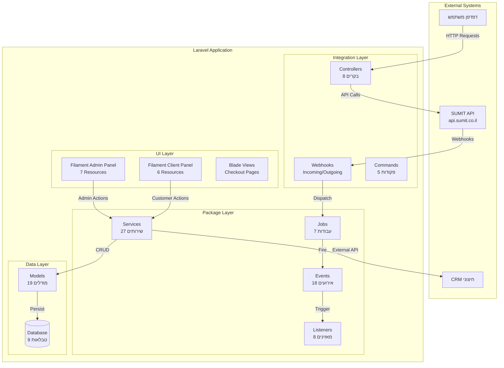
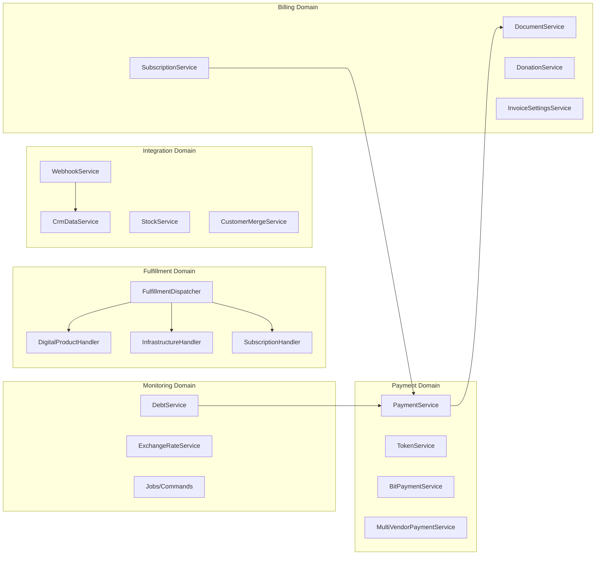
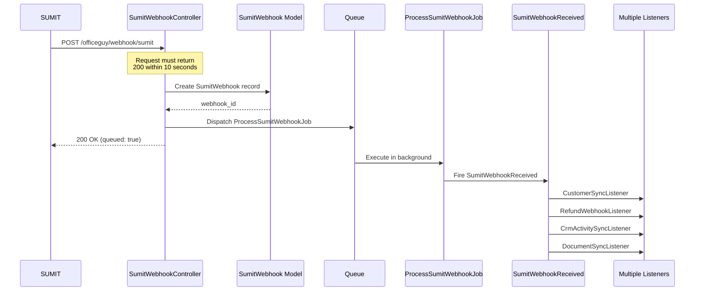
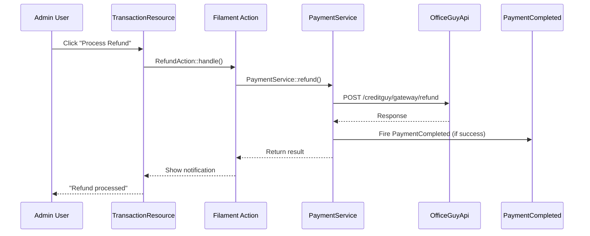
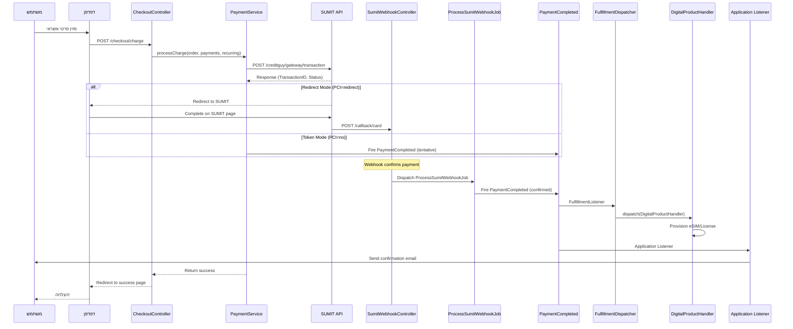
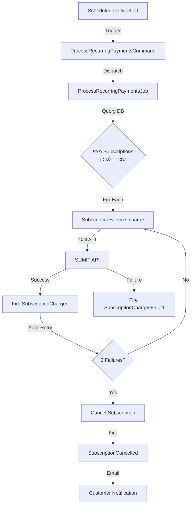
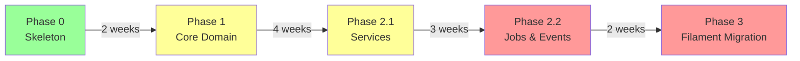

# תיעוד ארכיטקטוני מערכתי (System-Level Architecture)
# חבילת Laravel SUMIT Gateway

> **תאריך עדכון**: 2026-01-04  
> **גרסה**: v1.21.4  
> **מטרה**: ניתוח מערכתי מקיף של כל החבילה והקוד הצורך בה

---

## תוכן עניינים

1. [גבולות המערכת (System Boundaries)](#1-גבולות-המערכת)
2. [תחומי אחריות (Domains & Responsibilities)](#2-תחומי-אחריות)
3. [נקודות כניסה (Entry Points)](#3-נקודות-כניסה)
4. [זרימות תהליכים (Process Flows)](#4-זרימות-תהליכים)
5. [ארכיטקטורת Filament](#5-ארכיטקטורת-filament)
6. [מודל Async & Jobs](#6-מודל-async--jobs)
7. [הודעות ואימיילים](#7-הודעות-ואימיילים)
8. [Anti-Patterns וסיכונים](#8-anti-patterns-וסיכונים)
9. [הערכת מוכנות לשכתוב](#9-הערכת-מוכנות-לשכתוב)
10. [סיכום מנהלים](#10-סיכום-מנהלים)

---

## 1. גבולות המערכת

### 1.1 שכבות המערכת



### 1.2 הגדרות גבולות

#### Package (Domain Logic - Reusable)
**מיקום**: `/src/*`

**אחריות**:
- ✅ תקשורת עם SUMIT API (OfficeGuyApi)
- ✅ לוגיקת תשלום (PaymentService, TokenService, BitPaymentService)
- ✅ ניהול מסמכים (DocumentService)
- ✅ ניהול מנויים (SubscriptionService)
- ✅ ניהול Webhooks (WebhookService)
- ✅ ניהול CRM (CrmDataService, CrmSchemaService)
- ✅ Fulfillment Handlers (Digital, Infrastructure, Subscription)
- ✅ Contracts (Payable, Invoiceable, HasSumitCustomer)

**Public API**:
```php
// Contracts
Payable, Invoiceable, HasSumitCustomer

// Services (Facades)
PaymentService::processCharge()
TokenService::processToken()
DocumentService::createOrderDocument()
SubscriptionService::create()
WebhookService::send()

// Events (for Listeners)
PaymentCompleted, SubscriptionCreated, SumitWebhookReceived

// Models (Eloquent)
OfficeGuyTransaction, OfficeGuyToken, OfficeGuyDocument, Subscription
```

**Internal Implementation** (לא לשימוש ישיר):
- DTOs (DataTransferObjects)
- Support Traits
- BackoffStrategy
- Middleware

#### Application (Business Orchestration)
**מיקום**: אפליקציית Laravel הצורכת (לא קיימת ב-repo זה)

**אחריות**:
- ✅ מודל Order/Invoice שמממש Payable
- ✅ קוד ספציפי לעסק (Provisioning, Email Templates)
- ✅ התאמות UI ייחודיות
- ✅ רישום Event Listeners מותאמים

**דוגמה**:
```php
// App\Models\Order.php
class Order implements Payable
{
    public function getPayableAmount(): float { ... }
    public function getCustomerEmail(): ?string { ... }
    // ... implement all Payable methods
}

// App\Listeners\SendOrderConfirmationEmail.php
class SendOrderConfirmationEmail
{
    public function handle(PaymentCompleted $event) { ... }
}
```

#### UI / Admin (Filament)
**מיקום**: `/src/Filament/*`

**אחריות**:
- ✅ Admin Panel (7 Resources) - ניהול Transactions, Tokens, Documents, Subscriptions, Webhooks, CRM
- ✅ Client Panel (6 Resources) - תצוגת לקוח של Transactions, Tokens, Documents, Subscriptions
- ✅ Settings Page (74 הגדרות)
- ✅ Widgets (PayableMappingsTableWidget)
- ✅ Actions (CreatePayableMappingAction)

### 1.3 נקודות שבהן גבולות נפרצים (Coupling Issues)

❌ **Coupling Problems**:

1. **Filament Resources מכילים Business Logic**
   - `ClientPaymentMethodResource.php` (62KB!) - לוגיקת טוקנים מוטמעת
   - צריך להעביר ל-Service Layer

2. **Controllers מכילים Stock Sync Logic**
   ```php
   // CheckoutController.php:24
   if (config('officeguy.checkout_stock_sync', false)) {
       app(StockService::class)->sync(forceIgnoreCooldown: false);
   }
   ```
   - צריך להיות ב-Middleware או Event Listener

3. **DocumentService יוצר מסמכים ישירות מתוך PaymentService**
   ```php
   // CheckoutController.php:62
   DocumentService::createOrderDocument($order, $customer, ...);
   ```
   - צריך להיות דרך Event Listener


---

## 2. תחומי אחריות

### 2.1 מיפוי Domains



### 2.2 פירוט Domain - Payment & Billing

**Owner**: Payment Domain  
**Files**:
- `PaymentService.php` (ליבה)
- `TokenService.php` (טוקנים)
- `BitPaymentService.php` (Bit)
- `MultiVendorPaymentService.php` (Multi-vendor)
- `OfficeGuyApi.php` (HTTP Client)

**Operations**:
```php
// Payment Processing
PaymentService::processCharge(Payable, int $payments, bool $recurring)
PaymentService::handleCallback(Request) // Card callback
PaymentService::getCredentials()

// Token Management
TokenService::processToken(User, string $pciMode)
TokenService::getTokenRequest(string $pciMode)

// Bit Payments
BitPaymentService::createTransaction(Payable, array $params)
BitPaymentService::handleWebhook(Request)
```

**Dependencies**:
- ✅ OfficeGuyApi (HTTP)
- ✅ OfficeGuyTransaction (Model)
- ✅ OfficeGuyToken (Model)
- ✅ Events: PaymentCompleted, PaymentFailed

**Events Fired**:
1. `PaymentCompleted` - כאשר תשלום מאושר
2. `PaymentFailed` - כאשר תשלום נכשל
3. `BitPaymentCompleted` - כאשר תשלום Bit מאושר
4. `MultiVendorPaymentCompleted` - כאשר תשלום Multi-vendor מאושר

### 2.3 פירוט Domain - Fulfillment / Provisioning

**Owner**: Fulfillment Domain  
**Files**:
- `FulfillmentDispatcher.php` (Orchestrator)
- `DigitalProductFulfillmentHandler.php`
- `InfrastructureFulfillmentHandler.php`
- `SubscriptionFulfillmentHandler.php`
- `GenericFulfillmentHandler.php`

**Operations**:
```php
// Dispatcher
FulfillmentDispatcher::register(PayableType, string $handlerClass)
FulfillmentDispatcher::dispatch(Payable, OfficeGuyTransaction)

// Handlers
DigitalProductFulfillmentHandler::handle(OfficeGuyTransaction)
InfrastructureHandler::handle(OfficeGuyTransaction)
SubscriptionHandler::handle(OfficeGuyTransaction)
```

**Architecture Pattern**: Type-Based Dispatch
```php
// ServiceProvider::boot()
$dispatcher = app(FulfillmentDispatcher::class);
$dispatcher->register(PayableType::DIGITAL, DigitalProductFulfillmentHandler::class);
$dispatcher->register(PayableType::INFRASTRUCTURE, InfrastructureHandler::class);

// FulfillmentListener triggers on PaymentCompleted
Event::listen(PaymentCompleted::class, FulfillmentListener::class);

// Listener dispatches based on PayableType
$type = $payable->getPayableType(); // PayableType::DIGITAL
$dispatcher->dispatch($payable, $transaction);
```

**Dependencies**:
- ✅ PaymentCompleted Event
- ✅ FulfillmentListener
- ✅ Payable Contract (getPayableType())

**Critical**: 
- ⚠️ Handler לא רשאי לבצע DB writes בלי idempotency check
- ⚠️ Handler צריך לקבל OfficeGuyTransaction (לא Payable ישירות)

### 2.4 פירוט Domain - Notifications & Emails

**Owner**: Application (לא Package!)  

**Package רק מספק Events**:
```php
Event::listen(PaymentCompleted::class, function ($event) {
    // Application code sends email
    Mail::to($event->payable->getCustomerEmail())
        ->send(new PaymentConfirmation($event->transaction));
});
```

**Files בחבילה**:
- `Events/PaymentCompleted.php`
- `Events/SubscriptionCreated.php`
- `Events/DocumentCreated.php`

**Decision Layer**: **Application Listener, לא Service!**

❌ **אסור לחבילה לשלוח אימיילים ישירות!**
✅ **חבילה רק מפעילה Events → Application מחליט אם לשלוח**

### 2.5 פירוט Domain - Monitoring & Automation

**Owner**: Monitoring Domain  
**Files**:
- `Jobs/CheckSumitDebtJob.php` - בדיקת חובות
- `Jobs/ProcessRecurringPaymentsJob.php` - טעינת מנויים
- `Jobs/StockSyncJob.php` - סנכרון מלאי
- `Jobs/SyncDocumentsJob.php` - סנכרון מסמכים
- `Commands/ProcessRecurringPaymentsCommand.php`
- `Commands/StockSyncCommand.php`

**Operations**:
```php
// Scheduled Commands
artisan officeguy:stock-sync
artisan officeguy:process-recurring
artisan officeguy:sync-documents
artisan officeguy:crm-sync-folders
```

**Dependencies**:
- ✅ DebtService
- ✅ SubscriptionService
- ✅ StockService
- ✅ DocumentService

**Scheduler Registration** (ServiceProvider):
```php
protected function registerStockSyncScheduler()
{
    if (config('officeguy.stock_sync_enabled', false)) {
        $this->app->booted(function () {
            $schedule = $this->app->make(Schedule::class);
            $frequency = config('officeguy.stock_sync_frequency', 'hourly');
            $schedule->command('officeguy:stock-sync')->{$frequency}();
        });
    }
}
```


---

## 3. נקודות כניסה

### 3.1 מפת Entry Points

| Trigger Type | Entry Point | Handler | Async? | Purpose |
|-------------|-------------|---------|--------|---------|
| **HTTP POST** | `/officeguy/checkout/charge` | CheckoutController@charge | ❌ | Charge payment |
| **HTTP POST** | `/officeguy/callback/card` | CardCallbackController | ❌ | SUMIT card callback |
| **HTTP POST** | `/officeguy/webhook/bit` | BitWebhookController | ✅ | Bit IPN webhook |
| **HTTP POST** | `/officeguy/webhook/sumit` | SumitWebhookController | ✅ | SUMIT CRM webhooks |
| **HTTP GET** | `/officeguy/checkout/{id}` | PublicCheckoutController@show | ❌ | Display checkout form |
| **HTTP GET** | `/officeguy/success/{token}` | SecureSuccessController | ❌ | Success page (secured) |
| **HTTP GET** | `/officeguy/documents/{id}` | DocumentDownloadController | ❌ | Download document |
| **Scheduled** | `artisan officeguy:stock-sync` | StockSyncCommand | ✅ | Sync stock |
| **Scheduled** | `artisan officeguy:process-recurring` | ProcessRecurringPaymentsCommand | ✅ | Charge subscriptions |
| **Scheduled** | `artisan officeguy:sync-documents` | SyncAllDocumentsCommand | ✅ | Sync documents |
| **Filament Action** | Admin Panel → Create Transaction | TransactionResource | ❌ | Manual transaction |
| **Filament Action** | Admin Panel → Process Refund | TransactionResource | ✅ | Refund via SUMIT |
| **Filament Action** | Client Panel → Create Token | ClientPaymentMethodResource | ❌ | Save payment method |
| **Observer** | OfficeGuyTransaction::created | TransactionSyncListener | ✅ | Sync to CRM |
| **Event** | PaymentCompleted | FulfillmentListener | ❌ | Dispatch fulfillment |

### 3.2 Webhook Flow (Incoming)



**Critical Design Decision**:
- ✅ Controller מחזיר 200 **מיידית** (SUMIT דורש תגובה תוך 10 שניות)
- ✅ עיבוד מתבצע ב-Job **אסינכרוני**
- ✅ Job מפעיל Event → Multiple Listeners מעבדים במקביל

### 3.3 Filament Actions Flow



**Anti-Pattern Alert**:
❌ Filament Action **לא רשאי** לבצע Business Logic ישירות  
✅ Filament Action **צריך** לקרוא ל-Service Layer


---

## 4. זרימות תהליכים

### 4.1 תהליך תשלום מקצה לקצה (Happy Path)



### 4.2 שלבי ביניים - Payment Processing

**שלב 1: Request Validation**
```php
// CheckoutController.php
$order = OrderResolver::resolve($orderId);
if (!$order) {
    return response(['message' => 'Order not found'], 404);
}
```

**שלב 2: Credentials & Extra Params**
```php
$credentials = PaymentService::getCredentials();
$extra = [];
if ($redirectMode) {
    $extra['RedirectURL'] = route('checkout.success', ['order' => $orderId]);
}
```

**שלב 3: API Call**
```php
$result = PaymentService::processCharge($order, $paymentsCount, $recurring, ...);
// Calls: OfficeGuyApi::post($request, '/creditguy/gateway/transaction/')
```

**שלב 4: Transaction Record**
```php
OfficeGuyTransaction::createFromApiResponse($apiResponse, $payable, 'order');
```

**שלב 5: Event Firing**
```php
event(new PaymentCompleted($orderId, $payment, $response, $transaction, $payable));
```

**שלב 6: Fulfillment Dispatch**
```php
// FulfillmentListener
$dispatcher->dispatch($payable, $transaction);
// → Resolves PayableType → Handler
```

### 4.3 תהליך Subscription Recurring



**Jobs Involved**:
1. `ProcessRecurringPaymentsJob` (Orchestrator)
2. `SendWebhookJob` (Notification)

**Events**:
1. `SubscriptionCharged` - טעינה מוצלחת
2. `SubscriptionChargesFailed` - טעינה נכשלה
3. `SubscriptionCancelled` - מנוי בוטל לאחר 3 כשלונות

**Side Effects**:
- DB: עדכון `subscriptions.last_charged_at`
- DB: יצירת `officeguy_transactions` חדש
- Email: Application Listener שולח הודעה

---

## 5. ארכיטקטורת Filament

### 5.1 Filament כ-UI Layer נפרד

**Filament Panels**:
1. **Admin Panel** - 7 Resources
   - TransactionResource (עסקאות)
   - TokenResource (אמצעי תשלום)
   - DocumentResource (מסמכים)
   - SubscriptionResource (מנויים)
   - WebhookEventResource (Webhooks יוצאים)
   - SumitWebhookResource (Webhooks נכנסים)
   - VendorCredentialResource (Multi-vendor)
   - CrmActivities, CrmEntities, CrmFolders (CRM)

2. **Client Panel** - 6 Resources
   - ClientTransactionResource (עסקאות של הלקוח)
   - ClientPaymentMethodResource (אמצעי תשלום)
   - ClientDocumentResource (מסמכים)
   - ClientSubscriptionResource (מנויים)
   - ClientWebhookEventResource (Webhooks יוצאים)
   - ClientSumitWebhookResource (Webhooks נכנסים)

### 5.2 מה מותר ל-Filament לעשות

✅ **Allowed Operations**:
```php
// 1. Read operations (Query Builder)
public static function table(Table $table): Table
{
    return $table
        ->query(OfficeGuyTransaction::query())
        ->columns([...]);
}

// 2. Dispatch to Service Layer
Action::make('refund')
    ->action(function (OfficeGuyTransaction $record) {
        app(PaymentService::class)->refund($record);
    });

// 3. Fire Events
Action::make('approve')
    ->action(function (OfficeGuyTransaction $record) {
        event(new TransactionApproved($record));
    });

// 4. Dispatch Jobs
Action::make('syncAll')
    ->action(function () {
        SyncDocumentsJob::dispatch();
    });
```

### 5.3 מה אסור ל-Filament לעשות

❌ **Forbidden Operations**:

**1. Business Logic ישירות**
```php
// ❌ BAD - Business logic in Filament Action
Action::make('charge')
    ->action(function (Order $order) {
        $token = OfficeGuyToken::where('user_id', auth()->id())->first();
        $response = Http::post('https://api.sumit.co.il/...', [...]);
    });

// ✅ GOOD - Delegate to Service
Action::make('charge')
    ->action(function (Order $order) {
        app(PaymentService::class)->processCharge($order, 1, false);
    });
```

### 5.4 Current Violations

**ClientPaymentMethodResource.php** (62KB!)
- Line 450+: Token processing logic embedded
- ❌ Should be in TokenService!

**Recommendation**: 
```php
// Refactor to:
Action::make('createToken')
    ->action(function (array $data) {
        app(TokenService::class)->createFromSingleUse(
            $data['single_use_token'],
            auth()->user()
        );
    });
```

---

## 6. מודל Async & Jobs

### 6.1 סיווג Jobs

#### Orchestrators (מתאמים)

| Job | Purpose | Frequency | Idempotent? |
|-----|---------|-----------|-------------|
| `ProcessRecurringPaymentsJob` | טעינת כל המנויים | Daily 03:00 | ✅ Yes |
| `ProcessSumitWebhookJob` | עיבוד Webhook | On-demand | ✅ Yes |
| `SyncDocumentsJob` | סנכרון מסמכים | Hourly | ✅ Yes |
| `StockSyncJob` | סנכרון מלאי | Configurable | ✅ Yes |

#### Executors (מבצעים)

| Job | Purpose | Retry? | Timeout |
|-----|---------|--------|---------|
| `SendWebhookJob` | שליחת Webhook | ✅ 3 tries | 30s |
| `SyncCrmFromWebhookJob` | סנכרון CRM | ✅ 3 tries | 60s |
| `CheckSumitDebtJob` | בדיקת חוב | ✅ 3 tries | 30s |

**Retry Strategy**:
```php
class SendWebhookJob implements ShouldQueue
{
    public int $tries = 3;
    public int $timeout = 30;
    
    public function backoff(): array
    {
        // Exponential backoff: 10s, 30s, 90s
        return [10, 30, 90];
    }
    
    public function failed(\Throwable $exception): void
    {
        event(new FinalWebhookCallFailedEvent($this->uuid, $exception));
    }
}
```

### 6.2 Idempotency Analysis

**✅ Idempotent Jobs** (בטוח להרצה חוזרת):

```php
// ProcessRecurringPaymentsJob
$subscriptions = Subscription::query()
    ->where('status', 'active')
    ->where('next_billing_date', '<=', now())
    ->get();
// ✅ Safe - Query checks current state
```

**❌ Non-Idempotent Operations** (סיכון):

```php
// ❌ Risky - No check if already charged
SubscriptionService::charge($subscription);

// ✅ Fixed - Check last charge
if ($subscription->last_charged_at < now()->subDay()) {
    SubscriptionService::charge($subscription);
}
```


---

## 7. הודעות ואימיילים

### 7.1 Decision Layer - מי מחליט?

**Package Layer** (Events Only):
```php
// PaymentService.php
event(new PaymentCompleted($orderId, $payment, $response, $transaction, $payable));

// ✅ Package does NOT send emails!
// ✅ Package only fires events
```

**Application Layer** (Listeners):
```php
// App\Listeners\SendPaymentConfirmationEmail.php
class SendPaymentConfirmationEmail
{
    public function handle(PaymentCompleted $event): void
    {
        Mail::to($event->payable->getCustomerEmail())
            ->send(new PaymentConfirmation($event->transaction));
    }
}
```

### 7.2 Deduplication Strategy

**Solution 1: Transaction State Check**
```php
class SendPaymentConfirmationEmail
{
    public function handle(PaymentCompleted $event): void
    {
        // ✅ Only send if webhook-confirmed
        if (!$event->isWebhookConfirmed()) {
            return;
        }
        Mail::send(...);
    }
}
```

**Solution 2: Sent Flag**
```php
// Add to transactions table: email_sent_at

if ($event->transaction->email_sent_at) {
    return; // ✅ Already sent
}

Mail::send(...);
$event->transaction->update(['email_sent_at' => now()]);
```

**Solution 3: Unique Job ID**
```php
class SendPaymentConfirmationEmail implements ShouldQueue
{
    public function uniqueId(): string
    {
        return 'payment-email-' . $this->transaction->id;
    }
}
```

---

## 8. Anti-Patterns וסיכונים

### 8.1 Coupling Issues

**Problem 1: Services קוראים ישירות לאחרים**
```php
// ❌ PaymentService calls DocumentService directly
if (config('officeguy.create_order_document', false)) {
    DocumentService::createOrderDocument($order, $customer);
}
```

**Solution**: Use Events
```php
// ✅ PaymentService fires event
event(new PaymentCompleted(...));

// ✅ DocumentSyncListener handles
class DocumentSyncListener
{
    public function handle(PaymentCompleted $event) {
        DocumentService::createOrderDocument(...);
    }
}
```

### 8.2 Logic Duplication

**Example**: Token processing logic duplicated
```php
// TokenService.php
public static function processToken(...) { /* logic */ }

// ClientPaymentMethodResource.php (line 450+)
protected function createTokenFromSingleUseToken(...) { /* same logic! */ }
```

**Solution**: Extract to Service (single source of truth)

### 8.3 Jobs Without Guards

**Problem**: Job runs without state check
```php
// ❌ ProcessRecurringPaymentsJob
Subscription::all()->each(fn($sub) => $this->charge($sub));
```

**Solution**: Add State Checks
```php
// ✅ Guard with query
Subscription::query()
    ->where('status', 'active')
    ->where(fn($q) => $q->whereNull('last_charged_at')
        ->orWhere('last_charged_at', '<', now()->subDay()))
    ->each(fn($sub) => $this->charge($sub));
```

### 8.4 Uncontrolled Side-Effects

**Problem**: Observer fires on ANY save
```php
// ❌ TransactionObserver
public function saved(OfficeGuyTransaction $transaction)
{
    // Fires during seeding, testing, etc.
    event(new TransactionSynced($transaction));
}
```

**Solution**: Use explicit Events
```php
// ✅ Only fire when explicitly called
PaymentService::processCharge(...);
event(new PaymentCompleted(...)); // Explicit!
```

---

## 9. הערכת מוכנות לשכתוב

### 9.1 רכיבים מוכנים ל-Extraction

#### ✅ Phase 0 – Skeleton (Ready Now)
**מה לחלץ**:
- `Contracts/` (Payable, Invoiceable, HasSumitCustomer)
- `Enums/` (PayableType, PaymentStatus, PciMode, Environment)
- `DTOs/` (AddressData, CustomerData, CheckoutIntent)
- `Support/Traits/`

**למה זה מוכן**:
- ✅ אין תלויות חיצוניות
- ✅ Pure data structures
- ✅ ניתן לשימוש חוזר

#### ✅ Phase 1 – Core Domain (Needs Refactoring)
**מה לחלץ**:
- `Services/OfficeGuyApi.php`
- `Services/PaymentService.php`
- `Services/TokenService.php`
- `Models/OfficeGuyTransaction.php`

**מה צריך לתקן**:
1. **הסרת תלויות ב-config()**
   ```php
   // ❌ Current
   $companyId = config('officeguy.company_id');
   
   // ✅ After - Inject SettingsService
   public function __construct(
       private readonly SettingsService $settings
   ) {}
   ```

2. **הסרת Event firing ישירות**
   ```php
   // ❌ Current
   event(new PaymentCompleted(...));
   
   // ✅ After - Return DTO
   return new PaymentResult(success: true, transaction: $tx);
   ```

### 9.2 סדר מומלץ ל-Rewrite



**Phase 0 – Skeleton** (2 weeks)
- Extract Contracts, Enums, DTOs
- Create `sumit/contracts` package
- Publish to Packagist
- Test integration

**Phase 1 – Core Domain** (4 weeks)
- Extract OfficeGuyApi, PaymentService, TokenService
- Refactor to use DI (SettingsService)
- Remove direct Event firing
- Add unit tests (70%+ coverage)

**Phase 2.1 – Services** (3 weeks)
- Extract DocumentService, SubscriptionService
- Extract WebhookService, CrmDataService
- Create Repository interfaces
- Implement Laravel adapters

**Phase 2.2 – Jobs & Events** (2 weeks)
- Extract Jobs (with Repository pattern)
- Extract Events (with DTOs, not Models)
- Extract Listeners (with Adapter pattern)

**Phase 3 – Filament Migration** (2 weeks)
- Refactor Resources (remove business logic)
- Create Service Actions
- Test all panels

**Total**: ~13 weeks (3 months)

---

## 10. סיכום מנהלים

### 10.1 חוזקות 💪

1. **ארכיטקטורה מודולרית**
   - הפרדה טובה בין Contracts, Services, Models
   - שימוש נכון ב-Events & Listeners

2. **תמיכה מלאה ב-Filament v4**
   - 7 Admin Resources + 6 Client Resources
   - UI עדכני ומתוחזק

3. **Async Processing**
   - כל Webhooks מעובדים ב-Jobs אסינכרוניים
   - Retry Strategy עם Exponential Backoff

4. **Extensibility**
   - Payable Contract מאפשר שימוש בכל מודל
   - Container-Driven Fulfillment

5. **Feature Set מקיף**
   - Payments (Card, Bit, Multi-vendor)
   - Subscriptions, Documents, CRM, Stock Sync

### 10.2 חולשות 🚨

1. **Business Logic ב-Filament**
   - ClientPaymentMethodResource.php (62KB!) מכיל לוגיקה
   - צריך Refactoring ל-Service Layer

2. **Tight Coupling בין Services**
   - PaymentService קורא ל-DocumentService ישירות
   - צריך Event-Driven Architecture

3. **Lack of Repository Pattern**
   - Services משתמשים ישירות ב-Eloquent
   - קשה לבדיקה (Unit Testing)

4. **Configuration Management**
   - 74 הגדרות ב-DB + Config + .env
   - מסובך לעקוב

5. **No DTOs במקומות קריטיים**
   - Events מכילים Eloquent Models
   - בעיה עם Queue serialization

### 10.3 סיכונים קריטיים ⚠️

| סיכון | חומרה | סבירות | Mitigation |
|-------|--------|---------|------------|
| **Webhook Deduplication** | 🔴 High | High | Add `email_sent_at` flag |
| **Job Idempotency** | 🟡 Medium | Medium | Add state checks |
| **Filament Business Logic** | 🟡 Medium | Low | Refactor to Services |
| **Observer Side-Effects** | 🟡 Medium | Medium | Use Events explicitly |
| **Config Precedence** | 🟢 Low | Low | Document clearly |

### 10.4 המלצות אסטרטגיות 🎯

#### טווח קצר (1-2 חודשים)
1. **Deduplication Checks**
   - Add `email_sent_at` to transactions
   - Check webhook confirmation

2. **Refactor ClientPaymentMethodResource**
   - Extract to TokenService
   - Filament as UI-only

3. **Repository Pattern**
   - Create SubscriptionRepository
   - Inject into Services

#### טווח בינוני (3-6 חודשים)
4. **Event-Driven Architecture**
   - Remove Service→Service calls
   - Use Events for communication

5. **Extract Core Package**
   - `sumit/contracts`
   - `sumit/core` (Services + API)

6. **Comprehensive Tests**
   - Unit tests (70%+ coverage)
   - Integration tests
   - E2E tests

#### טווח ארוך (6-12 חודשים)
7. **Clean Architecture Rewrite**
   - Domain Layer
   - Application Layer
   - Infrastructure Layer

8. **Multi-Tenant Support**
   - Multiple SUMIT accounts
   - Tenant-scoped queries

9. **API Gateway Pattern**
   - Circuit Breaker
   - Caching

### 10.5 תמחור Refactoring

| Phase | Timeline | Risk | Priority |
|-------|----------|------|----------|
| **Quick Wins** | 2 weeks | Low | 🔴 High |
| **Filament Cleanup** | 4 weeks | Medium | 🟡 Medium |
| **Repository Pattern** | 6 weeks | Medium | 🟡 Medium |
| **Event-Driven** | 8 weeks | High | 🟢 Low |
| **Package Extraction** | 12 weeks | High | 🟢 Low |
| **Clean Architecture** | 24 weeks | Very High | 🟢 Future |

---

## סיכום

חבילת Laravel SUMIT Gateway היא **מערכת מורכבת ומקיפה** עם יכולות רבות. היא **עובדת טוב** בפועל, אך יש **חובות טכניים** שצריך לטפל בהם.

**המלצה עיקרית**: התחל מ-**Quick Wins** (Deduplication, Idempotency) ובנה בהדרגה לעבר **Clean Architecture**.

**תאריך יעד**: תוך **3-6 חודשים** ניתן להשיג ארכיטקטורה יציבה ובת-תחזוקה.

---

**תודה על הקריאה!**  
**מסמך זה מעודכן ב-2026-01-04**  
**לשאלות ובירורים**: [GitHub Issues](https://github.com/nm-digitalhub/SUMIT-Payment-Gateway-for-laravel/issues)
